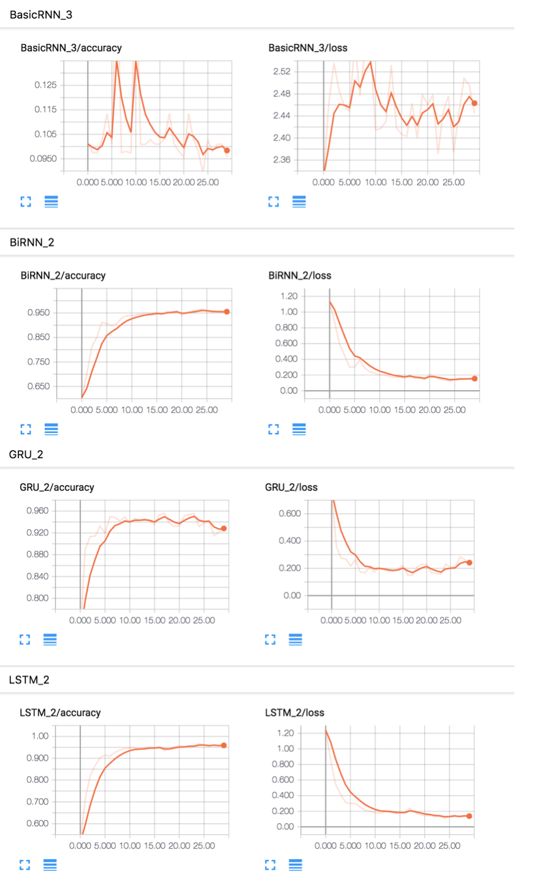

TensorFlow-RNNs
==============================

Implementations of RNNs in TensorFlow. This code tried to compare several RNN algorithms 
to solve MNIST classification problem.

# Algorithms

* RNN
* LSTM
* LSTM with layer normalization and recurrent dropout 
* GRU
* Bidirectional RNN

# How to run

```
$ make run OPTIONS='--model_type=basic'
```

# Evaluation

loss, accuracy transition can be seen with TensorBoard. 

```
# Clean TensorBoard log directory
$ make clean
$ make run OPTIONS='--model_type=XXX'

$ tensorboard --logdir=./graphs/rnn
```



# Reference

* [F.A. Gers, J. Schmidhuber. and F. Cummins. Learning to forget: Continual prediction with LSTM](https://pdfs.semanticscholar.org/1154/0131eae85b2e11d53df7f1360eeb6476e7f4.pdf)
* [Jimmy Lei Ba, Jamie Ryan Kiros, Geoffrey E. Hinton. Layer Normalization](https://arxiv.org/abs/1607.06450)
* [Core RNN Cells for use with TensorFlow's core RNN methods](https://www.tensorflow.org/api_guides/python/contrib.rnn#Core_RNN_Cells_for_use_with_TensorFlow_s_core_RNN_methods)
* [deeplearning-tensorflow-keras](https://github.com/yusugomori/deeplearning-tensorflow-keras)
* [詳解 ディープラーニング ~TensorFlow・Kerasによる時系列データ処理~ ](http://amzn.asia/hwRfoUh)

